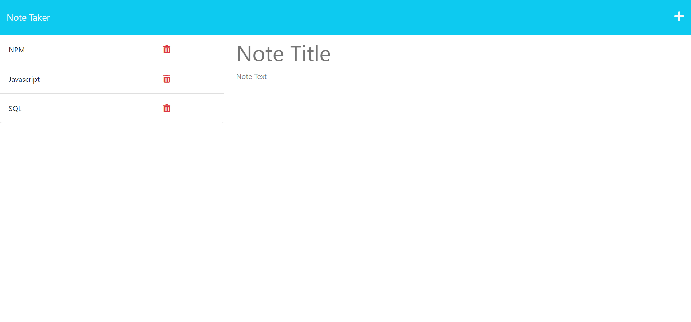

# Note Taker
            
## Description

This web application allows you to save and view notes from your browser. It uses Heroku as a server, so your data can be accessed from any browser on any device as long as you're connected to the internet. 

## Table of Contents

- [Installation](#installation)
- [Usage](#usage)

## Installation

There is no need to install anything for this web application. Simply go to https://sleepy-coast-83204.herokuapp.com/ in your preferred browser. 

## Usage

To use this web application open it in your browser. Click the "Get Started" button to be directed to the notes page. There you can enter and save new notes, click on old notes to view them, and click on the trash icons to delete them. 

## Questions

For any questions about this project please contact:

github.com/jzelasky

jzelasky@gmail.com

